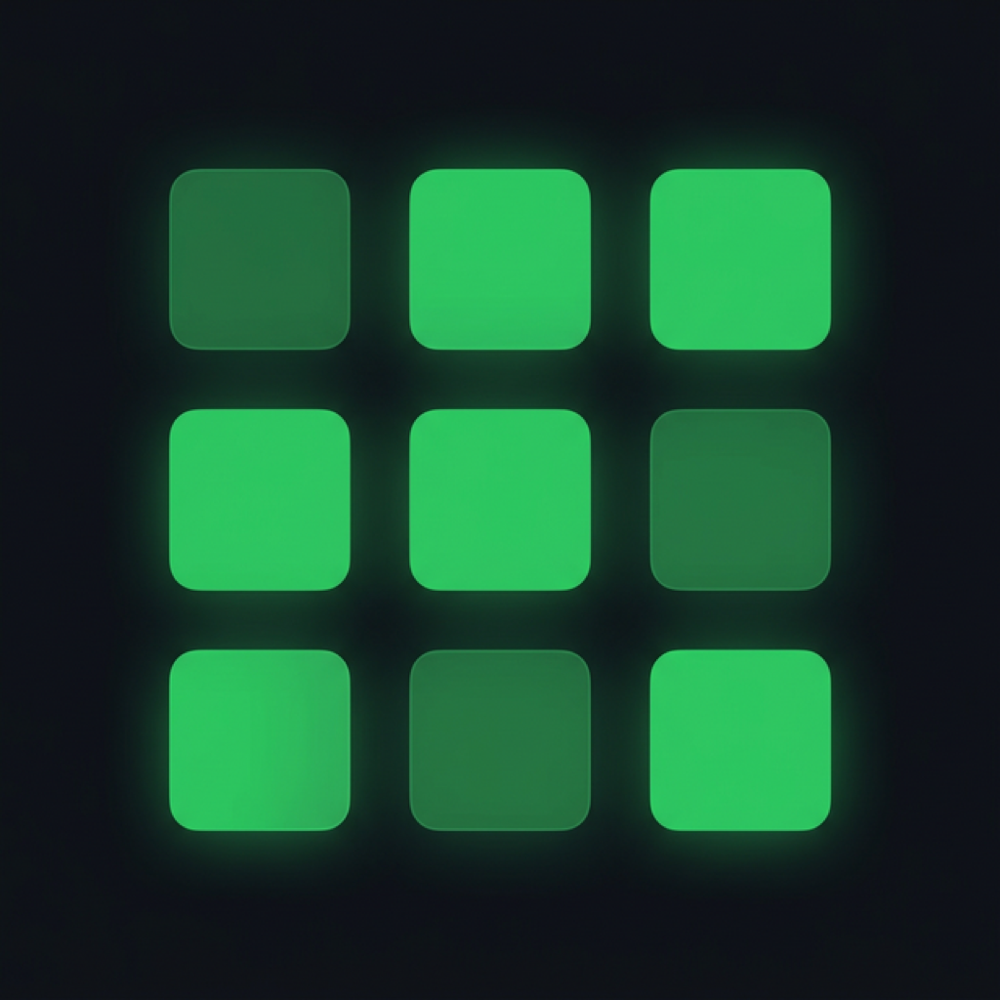

<div align="center">
  
  
  # HabitKit 🚀
  
  **A beautiful, gamified habit tracker built natively for iOS 17+**<br>
  *Turn your daily routines into an engaging experience with streaks, dynamic badges, analytics, and community leaderboards.*

  
  
  
  
</div>

---

## ⚠️ Project Status & Blockers

This project is currently **paused in its local-only state**. 

While the core app and local persistence (SwiftData) are fully functional, the planned cloud infrastructure (iCloud sync, RevenueCat monetization, App Store distribution) cannot be completed at this time.

**Why?**
Integrating iCloud/CloudKit and RevenueCat requires an active **Apple Developer Program Enrollment ($99/year)**, which I currently cannot afford. Specifically:
- **iCloud Sync**: Requires the CloudKit capability, which is disabled for free Personal Teams in Xcode.
- **RevenueCat**: Requires creating real In-App Purchase products in App Store Connect, which is unavailable without a paid account.
- **Distribution**: Cannot build to TestFlight or sequence an App Store release.

*The roadmap for these features remains documented in `goals.md` for future completion.*

---

## ✨ Features

- **Gamified Tracking**: Earn emojis, badges, and streaks for completing habits.
- **Flexible Scheduling**: Daily, weekly, specific weekdays, or interval-based habits.
- **Quantifiable Goals**: Track numeric targets (e.g., "Drink 2L of water", "Read 20 pages").
- **Vacation Mode**: Pause habits without losing your hard-earned streaks.
- **Rich Analytics**: Heatmaps, completion rates, and historical logs.
- **Haptic Feedback**: Delightful tactile responses for every interaction.
- **Data Portability**: Export your habit data to JSON or CSV anytime.

## 🛠 Tech Stack

### Core App
- **UI Framework**: SwiftUI (iOS 17+)
- **Local Persistence**: SwiftData
- **Architecture**: MVVM (Model-View-ViewModel)
- **Haptics**: `UIImpactFeedbackGenerator` & `UINotificationFeedbackGenerator`

### Planned Infrastructure Roadmap
*(See `goals.md` for full sprint tracking and setup instructions)*
- **Data Sync**: iCloud + CloudKit for native cross-device syncing. *(Blocked: Needs Apple Dev Account)*
- **Backend / Social**: Supabase (PostgreSQL + Realtime) for global communities, leaderboards, and chat.
- **Analytics**: PostHog for user behavior and telemetry.
- **Crash Reporting**: Firebase Crashlytics.
- **Monetization**: RevenueCat for Pro features. *(Blocked: Needs Apple Dev Account)*

---

## 💻 Getting Started (Local Usage)

You can run the fully functional local version of this app on your Mac using the free Xcode Personal Team.

### Prerequisites
- **Xcode 15.0** or later.
- **macOS Sonoma** or later.
- An iOS Simulator running iOS 17.0+ or a physical device.

### Installation

1. **Clone the repository:**
   ```bash
   git clone https://github.com/axref-js/habitkit.git
   cd habitkit
   ```

2. **Open the project:**
   ```bash
   open habitkit.xcodeproj
   ```

3. **Build and Run:**
   - Select your desired Simulator (e.g., iPhone 15 Pro) from the target dropdown in Xcode.
   - Press **Cmd + R** (or click the Play button) to build and run the app.

---

## 📂 Project Structure

- **`/Models`**: Core datatypes (`Habit`, `HabitLog`, `Community`) and singletons (`AuthManager`, `ProManager`).
- **`/Views`**: SwiftUI interface components divided into tabs (Home, Habits, Community, Profile).
- **`/Theme`**: Centralized color palette and font configurations.
- **`/Utilities`**: Helper classes like `HapticManager`.
- **`HabitKitApp.swift`**: Main app entry point configuring the `ModelContainer`.

---

## 📝 License

This project is licensed under the MIT License - see the LICENSE file for details.
